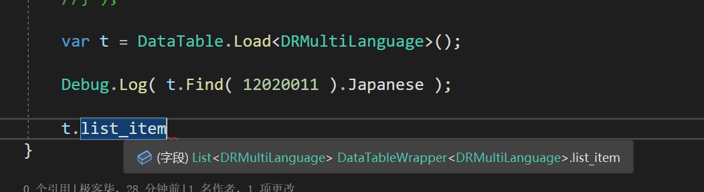

# XlsxTransverter
Unity 高效转表工具


> 剔除了上一版本的反射用法 使用代码生成的 Decode方法来自解析  并与内存stream流保持一一对应  极大的提高了读表的访问速度


# 字段和字节流 保持一一对应


# 程序自动生成 decode方法 


# 内存布局


# Unity读表插件
[./README_RES/DataTable.unitypackage]()


# 使用方式


> 选择一个excel目录进行批量转表


# Runtime加载表的方式

```csharp
    var table = DataTable.Load<DRMultiLanguage>();

    //通过Id去找数据
    DRMultiLanguage item = table.Find( 12020011 );

    //打印
    Debug.Log( item.Japanese );

    //获取整个带顺序的数据列表
    List<DRMultiLanguage> list = table.list_item;
```

