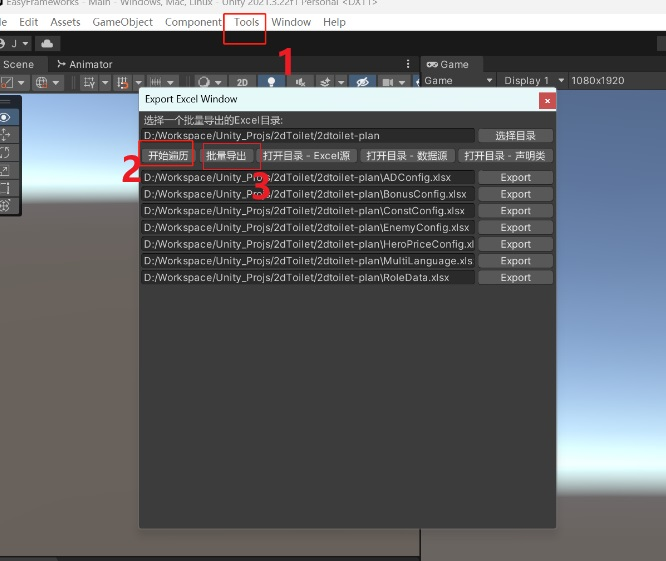
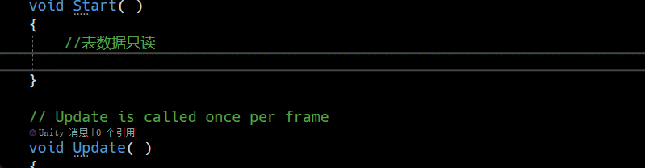
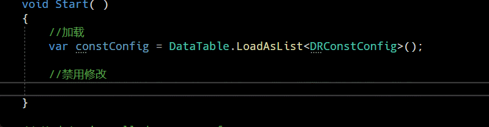
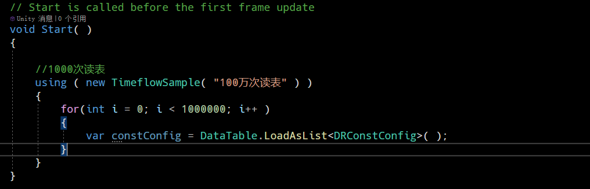
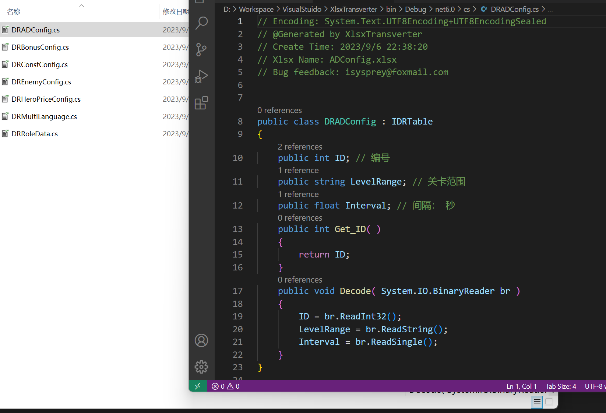
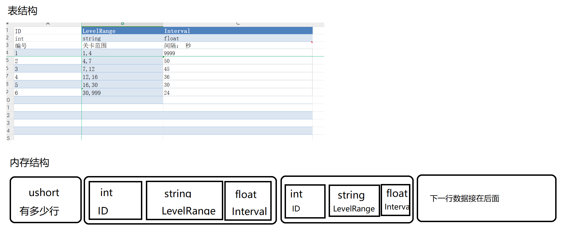
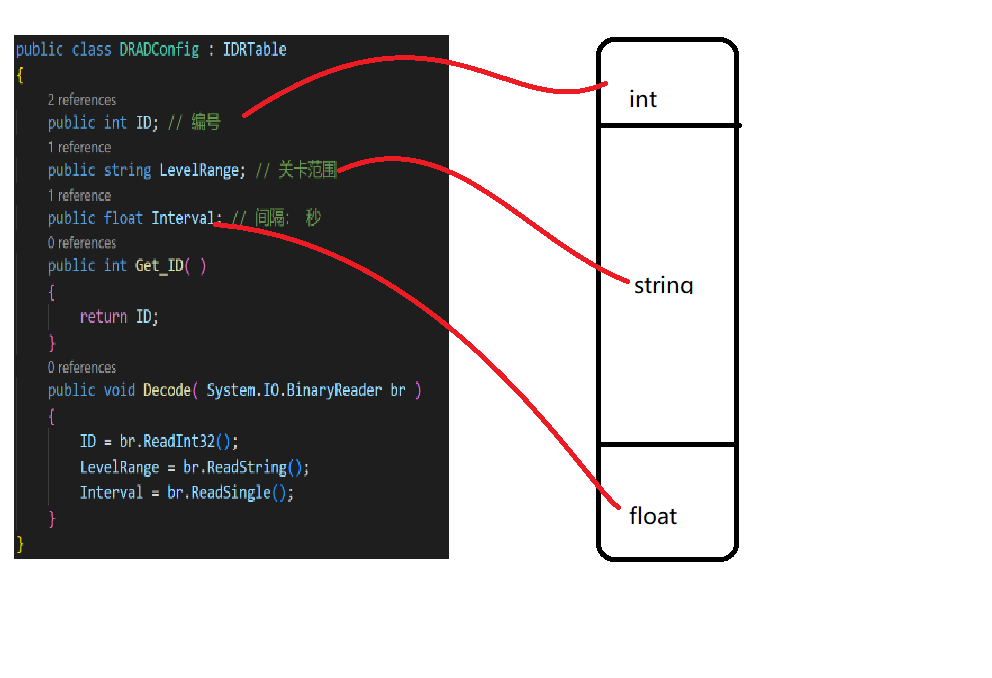

# 前文
Unity 高效轻量读表插件 ( 内置转表功能 )


# 开箱即用
> 内部做了兼容处理,不需要担心环境问题,跟着以下三个步骤走,即可

### 第一步将插件导入Unity项目中
[点击我,下载UnityPackage](./UnityPackage/DataTable.unitypackage)

### 第二步选择配置Excel表目录,进行转表


### 第三步 读取配置

读表


只读


读表性能高,100万次访问耗时仅303毫秒



```csharp
    //计时类
    class TimeflowSample : IDisposable
    {
        float begin_run_time = 0;
        string label = string.Empty;
        public TimeflowSample( string label )
        {
            begin_run_time = Time.realtimeSinceStartup;
            this.label = label;
        }

        public void Dispose( )
        {
            float ept = ( Time.realtimeSinceStartup - begin_run_time ) * 1000f;
            Debug.Log( $"Run {label} Finish.  elapsed processing time: {ept}ms" );
        }
    }
```

# 历史版本更新内容
> 剔除了上一版本的反射用法 使用代码生成的 Decode方法来自解析  并与内存stream流保持一一对应  极大的提高了读表的访问速度

# 由转表程序自动生成 Decode方法 静态加载, 移除动态反射代码, 更快更高效 



# 内存布局更新,更加紧凑



# 字段和字节流 保持一一对应
